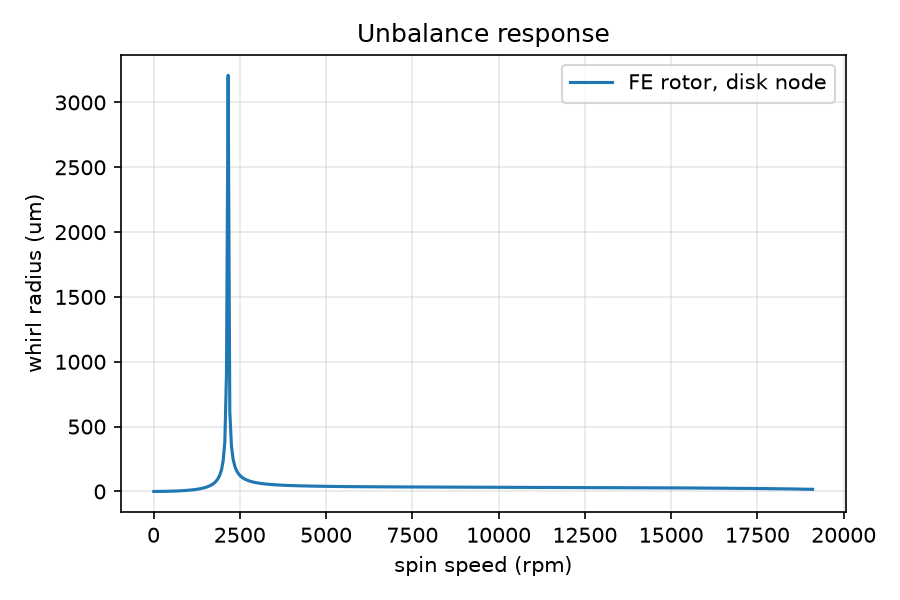
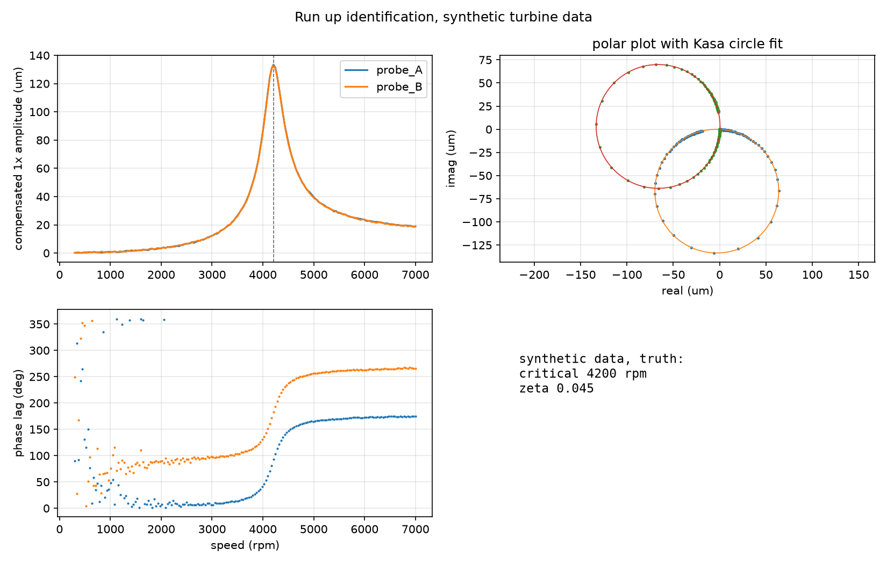

# Rotordynamics and Vibration Toolkit

A small Python library for linear vibration analysis and rotor dynamics, covering single and multi degree of freedom systems, isolator design, a Jeffcott rotor, and a Rayleigh beam finite element shaft model with lumped disks, isotropic bearings, gyroscopic effects and Campbell diagrams. It also carries a data layer: rotor definition files for a small steam turbine and an EV traction motor, a synthetic run up measurement with an identification routine that recovers critical speed and damping from it, and the ISO 21940-11 balance grade and ISO 10816-3 vibration zone tables. Every closed form in the SDOF, MDOF, Jeffcott and beam modules is exercised against an independent reference in the test suite, and the finite element model is cross checked against Euler-Bernoulli theory, the Jeffcott limit and the rigid disk gyroscopic formula.

## Figures

| | |
|---|---|
|  |  |
|  |  |
|  |  |

## Theory summary

Single degree of freedom. The equation m x'' + c x' + k x = f(t) gives wn = sqrt(k/m) and zeta = c / (2 sqrt(km)), and the free response is written in closed form for the under, critically and over damped cases. Steady state magnification is 1 / sqrt((1 - r^2)^2 + (2 zeta r)^2) with r = w/wn. Damping is identified from the logarithmic decrement, zeta = delta / sqrt(4 pi^2 + delta^2), or from the half power bandwidth, zeta = (f2 - f1) / (2 fn), which is a small damping approximation good for zeta well below about 0.1. Transmissibility T = sqrt((1 + (2 zeta r)^2) / ((1 - r^2)^2 + (2 zeta r)^2)) drops below one only for r > sqrt 2, which is the whole basis of the isolator design routine. Rotating unbalance gives the normalised amplitude M X / (m e) = r^2 / sqrt((1 - r^2)^2 + (2 zeta r)^2).

Multi degree of freedom. The undamped eigenproblem K phi = w^2 M phi is solved with a symmetric generalised solver, which gives mass normalised modes. Rayleigh damping C = alpha M + beta K is fitted to two target modal damping ratios, and the harmonic response is built by modal superposition with a direct inversion of the dynamic stiffness matrix provided as a cross check. The modal path warns when the damping matrix is not diagonalised by the undamped modes.

Jeffcott rotor. A massless elastic shaft with a central disk of mass m and eccentricity e has critical speed sqrt(k/m). The whirl radius is e r^2 / sqrt((1 - r^2)^2 + (2 zeta r)^2), and the phase lag between unbalance and response passes through 90 degrees at the critical speed and approaches 180 degrees above it, where the disk centre of mass moves inside the whirl orbit.

Shaft finite element model. Each element is a two node Euler-Bernoulli beam in two orthogonal planes with the consistent translational mass matrix plus the rotary inertia mass matrix, which makes it a Rayleigh beam. Lumped disks add mass and diametral inertia to the diagonal, and their polar inertia enters the skew symmetric gyroscopic matrix G, while the shaft polar inertia per length of 2 rho I contributes a distributed gyroscopic term with the same structure. Isotropic bearings add stiffness and damping at a node, and every analysis method also accepts fixed dofs, so a pinned shaft gets the same whirl and unbalance treatment as one on bearing springs. The whirl path requires a supported rotor and refuses to run on a free shaft, whose rigid body modes would otherwise leak numerical noise into the Campbell diagram. Whirl frequencies at each spin speed come from the state space eigenproblem of M q'' + (C + Omega G) q' + K q = 0, and whirl direction is read from the phase between the x and y components of the dominant node, reported as undetermined when the two are degenerate at rest. Critical speeds are the intersections of the whirl frequency curves with the synchronous line omega = Omega, found by sign change in either direction and linear interpolation.

In the example Campbell diagram the first backward and forward criticals sit only 1 rpm apart. That is physical, not a defect: the first mode of a symmetric rotor with a central disk barely tilts the disk, so the gyroscopic split is negligible. The FE unbalance plot also shows no second peak at the tilt mode, because the unbalance sits on the disk and the disk sits at the node of that mode.

Continuous beam. Euler-Bernoulli closed form frequencies w_n = (beta_n L)^2 / L^2 sqrt(EI / (rho A)) for the standard boundary conditions serve as the reference for the finite element shaft. The tabulated beta L roots follow Blevins and Inman.

Run up identification. The 1x vectors from a coast up or run up are runout compensated with the slow roll vector, then the critical speed comes from a parabolic peak pick, one damping estimate comes from the half power bandwidth, and a second comes from a Kasa least squares circle fit to the polar plot with the angle swept between the half power points.

## Data

Everything under `data/` is synthetic or transcribed from published standard values, with sources and caveats in `data/README.md`.

- `data/rotors/steam_turbine_rotor.yaml`: a three stage industrial steam turbine rotor at 7500 rpm with a station table, stage wheels, fluid film bearing coefficients and ISO 21940-11 G2.5 unbalance cases.
- `data/rotors/ev_motor_rotor.json`: a lighter EV traction motor rotor at 15000 rpm on ball bearings, in JSON to exercise the second loader path.
- `data/runup_turbine_synthetic.csv`: a synthetic run up generated by `examples/generate_runup_data.py` from the toolkit's own Jeffcott model with runout and noise added, first critical at 4200 rpm and zeta 0.045. The identification example recovers 4211 rpm and 0.0456 from it.
- `data/standards/`: the ISO 21940-11 balance grade table and the ISO 10816-3 zone boundary table as small CSVs.

## API

`vibtool.sdof`
- `SDOF(m, k, c)`, `SDOF.from_zeta(m, k, zeta)`: properties `wn`, `fn`, `zeta`, `wd` and methods `free_response(t, x0, v0)`, `frf(w)`, `magnification(r)`, `phase(r)`, `steady_state(F0, w)`.
- `damping_from_log_decrement(x_i, x_n, n)`, `damping_from_half_power(f1, f2, fn)`.
- `transmissibility(r, zeta)`, `isolator_stiffness(m, rpm, target_T, zeta)`, `unbalance_response(r, zeta)`.

`vibtool.mdof`
- `MDOF(M, K, C=None)`: `eigen()` returns `ModalResult(omega, modes)`. Also `set_rayleigh_damping(alpha, beta)`, `modal_damping()`, `frf(w, f, n_modes)`, `direct_frf(w, f)`.
- `rayleigh_fit(w1, z1, w2, z2)`, `two_dof_analytic(m1, m2, k1, k2)`.

`vibtool.rotor`
- `Jeffcott(m, k, c, e)`: `omega_cr`, `rpm_cr`, `zeta`, `response(Omega)`.
- `ShaftFE(L, d, E, rho, n_el)`: `add_disk(node, m, Id, Ip)`, `add_bearing(node, k, c)`, `undamped_frequencies(n_modes, fixed_dofs)`, `pinned_end_dofs()`, `whirl_frequencies(Omega, n_modes, fixed_dofs)`, `campbell(Omega_range, n_modes, fixed_dofs)`, `critical_speeds(Omega_range, n_modes, fixed_dofs)`, `unbalance_response(Omega_range, node, me, fixed_dofs)`.

`vibtool.beam`
- `beam_natural_frequencies(E, I, rho, A, L, bc, n_modes)`, `circular_section(d)`.

`vibtool.io`
- `load_rotor(path)` returns a `RotorSpec` with `build_shaft()`, `station_z(name)` and `node_of(shaft, station)`.
- `load_runup(path)` returns a `RunUp` with per probe amplitude, phase and `complex_vector(probe)`.
- `load_balance_grades(path)`, `permissible_unbalance(G, mass, rpm)`, `load_vibration_zones(path)`, `classify_vibration(v, zones, group, support)`.

`vibtool.runup`
- `fit_runup(speed_rpm, amp_um, phase_deg)` returns critical speed, half power and circle fit damping, the runout vector and the fitted modal circle.

`vibtool.plots`
- `plot_transmissibility`, `plot_mode_shapes`, `plot_campbell`, `plot_unbalance_response`.

## Validation

| Check | Reference | Result |
|---|---|---|
| SDOF magnification at r = 1 | 1 / (2 zeta) | exact |
| SDOF free response, log decrement identification | zeta = 0.03 | recovered to 1e-10 |
| Half power identification from numerically located bandwidth | zeta = 0.02 | within 1 percent, small damping approximation |
| Isolator stiffness for T = 0.1 at 1800 rpm | T from closed form | exact, undamped and damped |
| 2 DOF eigenvalues, m1 2 kg, m2 1 kg, k1 400 N/m, k2 100 N/m | quadratic closed form: 8.4807, 16.6757 rad/s | match to 1e-10 |
| Rayleigh damping fit and modal damping | zeta 0.02, 0.05 | exact |
| Modal superposition versus direct FRF | 3 DOF, proportional damping | agree to 1e-8 |
| Shaft FE first bending, pinned, 12 elements, 25 mm by 1 m steel | Euler-Bernoulli 50.778 Hz | 50.768 Hz, error 0.019 percent, asserted at rtol 1e-4 |
| Shaft FE second bending | Euler-Bernoulli 203.11 Hz | 202.97 Hz, error 0.072 percent, asserted at rtol 1e-3 |
| Shaft FE clamped-free, clamped-clamped and clamped-pinned | Euler-Bernoulli closed forms | within 0.5 percent |
| FE unbalance response, light shaft, rigid central disk | Jeffcott closed form | within 1 percent off resonance |
| Gyroscopic split of the rigid disk tilt mode at 100 rad/s | closed form with k_theta = 12 EI / L | within 0.5 percent both directions |
| Jeffcott critical speed, m 10 kg, k 4e6 N/m | sqrt(k/m) = 632.46 rad/s | exact, 6039.5 rpm |
| Jeffcott phase at critical, amplitude at critical | 90 degrees, e / (2 zeta) | exact |
| Campbell diagram, disk on isotropic bearings | repeated frequency at rest, backward drops and forward rises with speed | confirmed, first backward and forward criticals bracket the rest frequency |
| Run up identification on noise free Jeffcott data | critical 4200 rpm, zeta 0.045 | peak speed to 0.2 percent, both damping estimates within 15 percent |
| Rotor file loaders and standards tables | hand computed G2.5 budget, zone boundaries | exact |

The finite element frequencies sit slightly below Euler-Bernoulli because the Rayleigh beam includes rotary inertia, and the gap grows with mode number but stays under 0.5 percent for the third mode of this slender shaft.

## How to run

```
python -m pip install -e ".[test]"
python -m pytest -q                  # 45 tests
python examples/run_examples.py      # writes figures/*.png and prints critical speeds
python examples/rotor_from_file.py   # loads data/rotors/, Campbell and ISO checks
python examples/analyze_runup.py     # critical speed and damping from the run up CSV
python examples/generate_runup_data.py   # regenerates the synthetic run up file
```

Requires numpy, scipy, matplotlib and pyyaml, all pulled in by the install.

## Layout

```
src/vibtool/    sdof.py  mdof.py  rotor.py  beam.py  io.py  runup.py  plots.py
examples/       run_examples.py  rotor_from_file.py  analyze_runup.py  generate_runup_data.py
tests/          test_sdof.py  test_mdof.py  test_mdof_extra.py  test_rotor.py  test_beam.py  test_io.py  test_runup.py  test_plots.py
data/           rotors/  standards/  runup_turbine_synthetic.csv  README.md
figures/        generated plots
```

MIT license.
