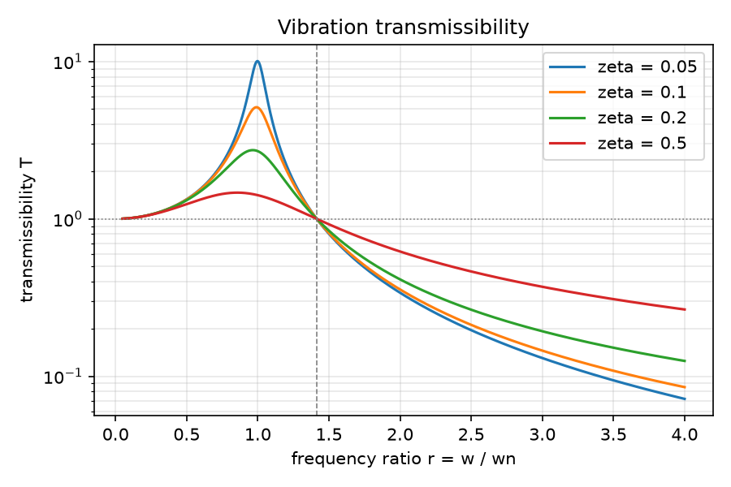
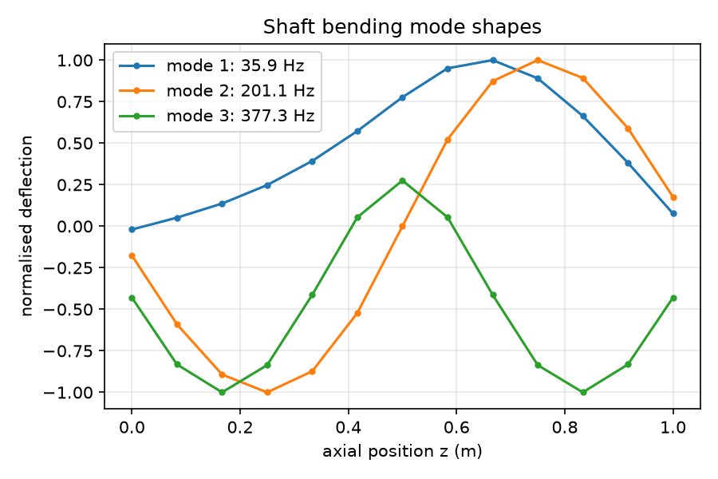
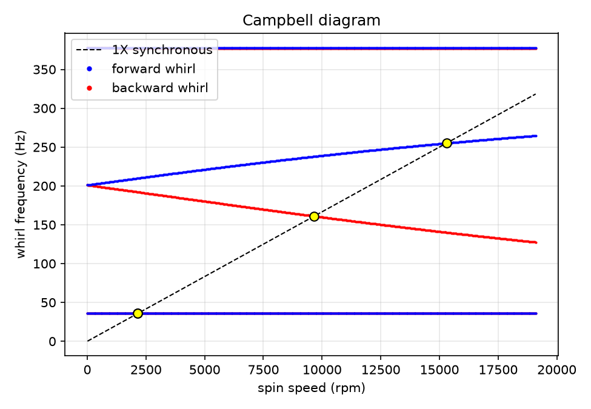
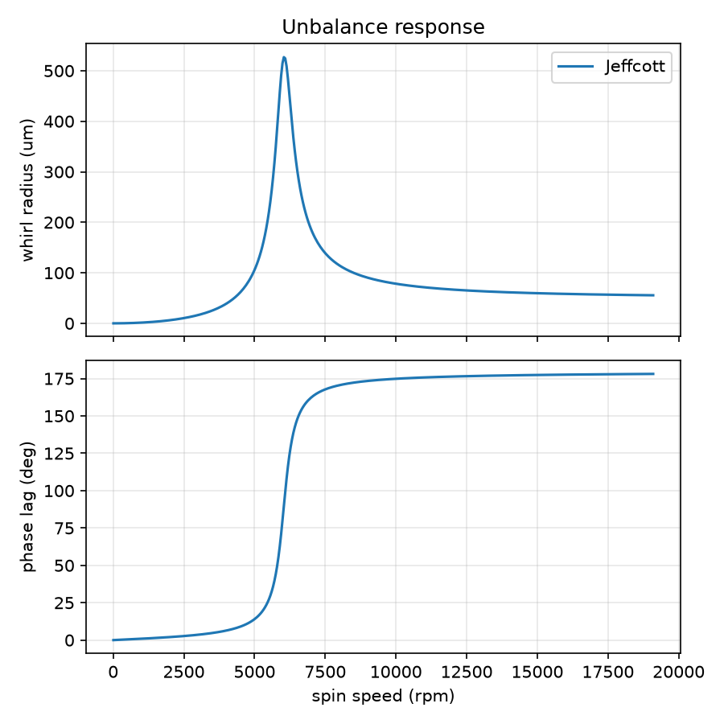

# Rotordynamics and Vibration Toolkit

A small, tested Python library for linear vibration analysis and rotor dynamics, covering single and multi degree of freedom systems, isolator design, a Jeffcott rotor, and a Rayleigh beam finite element shaft model with lumped disks, isotropic bearings, gyroscopic effects and Campbell diagrams. Every numerical model is checked against a closed form result in the test suite. No model goes untested.

## Figures

| | |
|---|---|
|  |  |
|  |  |

## Theory summary

Single degree of freedom. The equation m x'' + c x' + k x = f(t) gives wn = sqrt(k/m) and zeta = c / (2 sqrt(km)), and the free response is written in closed form for the under, critically and over damped cases. Steady state magnification is 1 / sqrt((1 - r^2)^2 + (2 zeta r)^2) with r = w/wn. Damping is identified from the logarithmic decrement, zeta = delta / sqrt(4 pi^2 + delta^2), or from the half power bandwidth, zeta = (f2 - f1) / (2 fn). Transmissibility T = sqrt((1 + (2 zeta r)^2) / ((1 - r^2)^2 + (2 zeta r)^2)) drops below one only for r > sqrt 2, which is the whole basis of the isolator design routine. Rotating unbalance gives the normalised amplitude M X / (m e) = r^2 / sqrt((1 - r^2)^2 + (2 zeta r)^2).

Multi degree of freedom. The undamped eigenproblem K phi = w^2 M phi is solved with a symmetric generalised solver, which gives mass normalised modes. Rayleigh damping C = alpha M + beta K is fitted to two target modal damping ratios, and the harmonic response is built by modal superposition with a direct inversion of the dynamic stiffness matrix provided as a cross check.

Jeffcott rotor. A massless elastic shaft with a central disk of mass m and eccentricity e has critical speed sqrt(k/m). The whirl radius is e r^2 / sqrt((1 - r^2)^2 + (2 zeta r)^2), and the phase lag between unbalance and response passes through 90 degrees at the critical speed and approaches 180 degrees above it, where the disk centre of mass moves inside the whirl orbit.

Shaft finite element model. Each element is a two node Euler-Bernoulli beam in two orthogonal planes with the consistent translational mass matrix plus the rotary inertia mass matrix, which makes it a Rayleigh beam. Lumped disks add mass and diametral inertia to the diagonal, and their polar inertia enters the skew symmetric gyroscopic matrix G, while the shaft polar inertia per length of 2 rho I contributes a distributed gyroscopic term with the same structure. Isotropic bearings add stiffness and damping at a node. Whirl frequencies at each spin speed come from the state space eigenproblem of M q'' + (C + Omega G) q' + K q = 0, and whirl direction is read from the phase between the x and y components of the dominant node. Critical speeds are the intersections of the whirl frequency curves with the synchronous line omega = Omega, found by sign change and linear interpolation.

Continuous beam. Euler-Bernoulli closed form frequencies w_n = (beta_n L)^2 / L^2 sqrt(EI / (rho A)) for the standard boundary conditions serve as the reference for the finite element shaft.

## API

`vibtool.sdof`
- `SDOF(m, k, c)`, `SDOF.from_zeta(m, k, zeta)`: properties `wn`, `fn`, `zeta`, `wd` and methods `free_response(t, x0, v0)`, `frf(w)`, `magnification(r)`, `phase(r)`, `steady_state(F0, w)`.
- `damping_from_log_decrement(x_i, x_n, n)`, `damping_from_half_power(f1, f2, fn)`.
- `transmissibility(r, zeta)`, `isolator_stiffness(m, rpm, target_T, zeta)`, `unbalance_response(r, zeta)`.

`vibtool.mdof`
- `MDOF(M, K, C=None)`: `eigen()` returns `ModalResult(omega, modes)`. Also `set_rayleigh_damping(alpha, beta)`, `modal_damping()`, `frf(w, f, n_modes)`, `direct_frf(w, f)`.
- `rayleigh_fit(w1, z1, w2, z2)`, `two_dof_analytic(m1, m2, k1, k2)`.

`vibtool.rotor`
- `Jeffcott(m, k, c, e)`: `omega_cr`, `rpm_cr`, `zeta`, `response(Omega)`.
- `ShaftFE(L, d, E, rho, n_el)`: `add_disk(node, m, Id, Ip)`, `add_bearing(node, k, c)`, `undamped_frequencies(n_modes, fixed_dofs)`, `pinned_end_dofs()`, `whirl_frequencies(Omega, n_modes)`, `campbell(Omega_range, n_modes)`, `critical_speeds(Omega_range, n_modes)`, `unbalance_response(Omega_range, node, me)`.

`vibtool.beam`
- `beam_natural_frequencies(E, I, rho, A, L, bc, n_modes)`, `circular_section(d)`.

`vibtool.plots`
- `plot_transmissibility`, `plot_mode_shapes`, `plot_campbell`, `plot_unbalance_response`.

## Validation

| Check | Reference | Result |
|---|---|---|
| SDOF magnification at r = 1 | 1 / (2 zeta) | exact |
| SDOF free response, log decrement identification | zeta = 0.03 | recovered within 0.002 |
| Isolator stiffness for T = 0.1 at 1800 rpm | T from closed form | exact (undamped and damped) |
| 2 DOF eigenvalues (m 2, 1 kg; k 400, 100 N/m) | quadratic closed form: 8.4807, 16.6757 rad/s | match to 1e-10 |
| Rayleigh damping fit and modal damping | zeta 0.02, 0.05 | exact |
| Modal superposition versus direct FRF | 3 DOF, proportional damping | agree to 1e-8 |
| Shaft FE first bending, pinned, 12 elements, 25 mm by 1 m steel | Euler-Bernoulli 50.778 Hz | 50.768 Hz, error 0.019 percent |
| Shaft FE second bending | Euler-Bernoulli 203.11 Hz | 202.97 Hz, error 0.072 percent |
| Jeffcott critical speed (m 10 kg, k 4e6 N/m) | sqrt(k/m) = 632.46 rad/s | exact, 6039.5 rpm |
| Jeffcott phase at critical, amplitude at critical | 90 degrees, e / (2 zeta) | exact |
| Campbell diagram, disk on isotropic bearings | repeated frequency at rest, backward drops and forward rises with speed | confirmed; first backward and forward criticals bracket the rest frequency |

The finite element frequencies sit slightly below Euler-Bernoulli because the Rayleigh beam includes rotary inertia, and the gap grows with mode number but stays under 0.5 percent for the third mode of this slender shaft.

## How to run

```
python -m pip install -e .          # or add src/ to PYTHONPATH
python -m pytest -q                 # 15 tests
python examples/run_examples.py     # writes figures/*.png and prints critical speeds
```

Requires numpy, scipy, matplotlib and pytest.

## Layout

```
src/vibtool/    sdof.py  mdof.py  rotor.py  beam.py  plots.py
examples/       run_examples.py
tests/          test_sdof.py  test_mdof.py  test_rotor.py
figures/        generated plots
```
